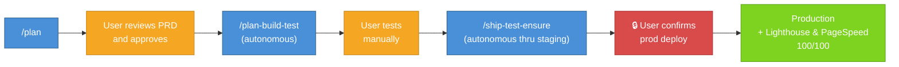

# Claude Workflow System

[](https://github.com/vinicius91carvalho/.claude/actions/workflows/test.yml)
[](https://github.com/vinicius91carvalho/.claude/releases)
[](LICENSE)
[](https://docs.anthropic.com/en/docs/claude-code)
[](#supported-languages)
[](#safety-enforcement-hooks)

A portable AI engineering system for Claude Code that applies automatically to every project. Built on the Compound Engineering philosophy: each unit of work makes subsequent units easier — not harder.

## Influences & References

This system is primarily shaped by hands-on experience building production software with AI agents, combined with ideas from:

- **[Compound Engineering](https://every.to/source-code/compound-engineering-the-definitive-guide)** — The methodology developed by [Every, Inc.](https://every.to/guides/compound-engineering) where each unit of work improves the system for the next. The Plan → Work → Review → Compound loop and the 80/20 split (planning+review vs. implementation) come from here. See also the [official Claude Code plugin](https://github.com/EveryInc/compound-engineering-plugin).
- **[Context Engineering](https://x.com/karpathy/status/1937902205765607626)** — The discipline of structuring everything an LLM needs to make reliable decisions, as articulated by [Andrej Karpathy](https://x.com/karpathy/status/1937902205765607626) and [Tobi Lütke](https://x.com/tobi/status/1935533422589399127). The agent architecture, worktree isolation, context budget rules, and context rot protocols in this system are context engineering in practice. See also [Context Engineering: 4 Principles for AI Coding CLIs](https://tail-f-thoughts.hashnode.dev/context-engineering-ai-coding-cli) for a practical walkthrough of these principles applied to this workflow.
- **[The AI-Human Engineering Stack](https://github.com/hjasanchez/agentic-engineering/blob/main/The%20AI-Human%20Engineering%20Stack.pdf)** (Mill & Sanchez, 2026) — A layered model (Prompt, Context, Intent, Judgment, Coherence) that informed the value hierarchy, judgment protocols, and evaluation framework.
- **[The Complete Guide to Specifying Work for AI](https://github.com/hjasanchez/agentic-engineering/blob/main/The%20Complete%20Guide%20to%20Specifying%20Work%20for%20AI.pdf)** (Mill & Sanchez, 2026) — Practical methods for translating human intent into AI-readable specifications that shaped the Contract-First pattern, Correctness Discovery, and PRD templates.
- **[From Vibe Coding to Agentic Engineering](https://heavychain.org/blog?article=from-vibe-coding-to-agentic-engineering)** (Jason Vertrees / Heavy Chain Engineering, 2026) — A practitioner's account of building 270K lines in one week with disciplined AI agents. Key ideas adopted: the Architecture Invariant Registry (cross-module contracts with preconditions/postconditions/invariants), the "Modular Success Trap" insight (modules pass in isolation but integration seams break), enforcement via hard-gate hooks rather than verbal instructions, and the Build Candidate concept as a design-phase gate.
- **Personal experience** — Patterns, anti-patterns, hooks, and safety rules discovered through months of real-world AI-assisted development across multiple production projects.

## Quick Start

> **CAUTION:** This system installs to `~/.claude/`, which is the **user-level** configuration directory for Claude Code. Cloning this repository will **replace your existing personal configuration** — including your `CLAUDE.md`, `settings.json`, hooks, and any other customizations you've made. This is NOT a per-project setup; it affects **every project** you open with Claude Code. Back up your existing `~/.claude/` directory before proceeding.

```bash
# 1. Back up your existing configuration (important!)
cp -r ~/.claude ~/.claude.backup 2>/dev/null

# 2. Clone to ~/.claude/
git clone <repository-url> ~/.claude

# 3. Open any project with Claude Code
cd /path/to/your/project
claude

# 4. That's it — the system loads automatically
```

Hooks enforce rules deterministically, agents handle complex work, and skills auto-invoke based on what you're doing. Project-specific context goes in each project's own `CLAUDE.md` (see [Getting Started](workflow/02-getting-started.md)).

**Plugins & custom hooks:** the shipped `settings.json` already enables 10 plugins from the official Anthropic marketplace plus `claude-hud` for the statusline. To add more, remove some, or wire a new hook into the lifecycle, see:

- [Installing Plugins](workflow/02-getting-started.md#installing-plugins) — marketplace add, `enabledPlugins`, update/remove
- [Adding Custom Hooks](workflow/09-hooks-and-enforcement.md#adding-custom-hooks) — script, register in `settings.json`, exit-code contract, test wiring

## How It Works

```
PLAN → WORK → REVIEW → COMPOUND → (next task is now easier)
```

The core loop. Plan + Review = 80% of effort. Work + Compound = 20%. The bottleneck is knowing **what** to build and **verifying** it was built correctly — not typing speed.

## The Autonomous Pipeline

The preferred end-to-end workflow minimizes human touchpoints to four: review the plan, approve it, test manually, confirm production deploy. Everything else runs without interruption.



**What each step does:**

1. **`/plan`** — Generates a PRD (Product Requirements Document) with sprint decomposition, acceptance criteria, and an architecture invariant registry. The user reviews and approves.
2. **`/plan-build-test`** — Picks up the approved PRD, spawns agent teams in isolated worktrees, implements each sprint, runs all tests and E2E locally. Runs autonomously from start to finish — no checkpoints.
3. **User tests manually** — The only hands-on step. Verify the feature works as intended.
4. **`/ship-test-ensure`** — Commits, pushes a branch, creates a PR, merges via CI/CD, follows the staging deploy, runs E2E on staging, then **asks the user once** before deploying to production. After production deploy, runs Lighthouse/PageSpeed audits.

**Safety gates that autonomous mode never skips:**
- Production deploy requires user confirmation
- Rollback decisions require user confirmation
- Escalation logic still applies (ambiguity, scope > 2x, etc.)
- Anti-Premature Completion Protocol still enforced
- Verification Integrity rules still enforced

After shipping, `/compound` auto-captures learnings and promotes patterns — making the next task easier. That's the compound loop.

## Skills

| Skill | What It Does | When to Use |
|---|---|---|
| `/create-project` | Greenfield project PRD with discovery interview and architecture defaults | "New project", "start a project", "build me an app" |
| `/plan` | Generates PRD only — writes a per-session active-plan pointer | "Just plan, don't build yet" |
| `/plan-build-test` | Plans, executes with agent teams, verifies locally — pointer-first plan resolution | "Build this feature / fix this bug" |
| `/adopt-plan` | Take over a PRD owned by another (typically dead) session — force-release stuck claims and rebind | "Adopt plan", "take over plan", "my pointer is gone" |
| `/research` | Deep multi-agent research via Stochastic Consensus & Debate | "How should I...", "compare approaches for...", "what's the best way to..." |
| `/ship-test-ensure` | Branch, PR, staging E2E, production deploy, Lighthouse (optional) | "Ship what I've built" |
| `/autonomous-staging` | Hands-off chain: `/plan-build-test` → `/ship-test-ensure` halting at staging (exit 99) | "Ship the PRD unattended", "fire and forget to staging" |
| `/verify-staging` | Read-only staging verification: health endpoints + Playwright smoke + AC check | "Verify staging", "check staging", "is it live yet" |
| `/compound` | Captures learnings, updates error registry, evolves system | Auto-invoked after task completion |
| `/workflow-audit` | Reviews model performance, error patterns, rule staleness | Monthly or after 10+ sessions |
| `/skill-evolve` | Mines 30 days of transcripts for friction patterns; emits review-only proposals (never writes to skills) | "Evolve skills", "what friction patterns am I hitting" |
| `/update-docs` | Analyzes codebase and updates README/docs to match current code | "Update docs", "sync readme", or when push is blocked by stale docs |
| `/find-skills` | Discovers and installs skills from the open agent skills ecosystem | "Find a skill for X", "is there a skill that can..." |
| `/playwright-stealth` | Anti-detection browsing via Patchright + Xvfb for own content verification | "Stealth browse", "get page content", "check this site" |

**Autonomous pipeline:** `/plan` → review PRD → `/plan-build-test` (autonomous) → manual test → `/ship-test-ensure` (autonomous through staging, confirms before production). For fully hands-off staging delivery, `/autonomous-staging` chains the first two steps and halts at exit 99 before production.

### Concurrent Sessions

Multiple `claude` terminals can drive **independent plans on the same repo simultaneously**. Each session owns one plan via a per-session pointer (`~/.claude/state/active-plan-${CLAUDE_SESSION_ID}.json`). Branches and worktrees are namespaced by `prd_slug` (e.g. `sprint/<prd-slug>/01-bootstrap`), and final merges to `main` are serialized via `flock`. `/adopt-plan` lets a fresh terminal pick up an orphaned plan after a crash. See [Sprint System](workflow/06-sprint-system.md) for the full state machine.

## The Three Agents

| Agent | Role | Model | Key Constraint |
|---|---|---|---|
| **Orchestrator** | Delegates, coordinates, merges | opus | Never implements code directly |
| **Sprint Executor** | Implements sprints in isolation | sonnet | Cannot delegate to other agents |
| **Code Reviewer** | Read-only post-merge audit | sonnet | Cannot modify any files |

## Safety Enforcement (Hooks)

The system uses deterministic hooks — real code that runs before/after every action. Unlike CLAUDE.md instructions (which the model might ignore), hooks **cannot be bypassed**.

| Hook | Trigger | What It Does |
|---|---|---|
| `block-dangerous.sh` | PreToolUse(Bash) | Blocks `rm -rf /`, force push; project-aware package manager enforcement |
| `block-heavy-bash.sh` | PreToolUse(Bash) | Soft-blocks heavy build/test commands in the main agent (delegate to subagent) |
| `check-docs-updated.sh` | PreToolUse(Bash) | Blocks push if hooks/skills/agents changed without doc updates |
| `check-test-exists.sh` | PreToolUse(Write/Edit) | TDD gate — blocks production code edits without test file (16 languages) |
| `enforce-delegation.sh` | PreToolUse(Read/Grep/Bash/Agent) | Soft-blocks after 2+ direct reads; immediately blocks files ≥50KB; enforces orchestrator-delegates pattern |
| `post-edit-quality.sh` | PostToolUse(Write/Edit) | Auto-formats code using detected formatter (Biome, ruff, rustfmt, gofmt, etc.) |
| `check-invariants.sh` | PostToolUse(Write/Edit) | Verifies INVARIANTS.md rules after edits |
| `scan-secrets.sh` | PostToolUse(Write/Edit) | Scans edited files for exposed secrets and credentials |
| `progress-signal.sh` | PostToolUse(Write/Edit/MultiEdit) | Writes sprint-finalized signal when all sprints complete; gates Stop hook execution |
| `end-of-turn-typecheck.sh` | Stop | Static type checking (tsc, cargo check, go vet, mypy, pyright, etc.) |
| `cleanup-artifacts.sh` | Stop | Moves stray media files to `.artifacts/` and updates `.gitignore` |
| `cleanup-worktrees.sh` | (orchestrator) | Prunes stale worktrees and removes merged sprint branches |
| `compound-reminder.sh` | (signal-gated) | Blocks session end without learning capture when sprint-finalized signal is present |
| `verify-completion.sh` | Stop | Blocks premature completion without evidence |
| `session-start.sh` | SessionStart | Detects proot-distro ARM64, warns about issues, loads session state |
| `reset-delegation-counter.sh` | UserPromptSubmit | Resets the delegation read counter each turn |
| `compact-save.sh` | PreCompact | Saves session state before context compression |
| `compact-restore.sh` | PostCompact | Restores session state after context compression |
| `authorize-stop-hooks.sh` | (Bash utility) | One-shot helper Claude calls before task completion to authorize Stop hook execution |
| `relocate-plan.sh` | PostToolUse(ExitPlanMode) | Moves ExitPlanMode markdown out of `~/.claude/plans/` into `<project>/docs/plans/` (fail-open) |
| `track-active-work.sh` | PreToolUse(Write/Edit/Bash) | Marks the session as actively working — input to active-plan pointer GC and Stop-hook gating |
| `consume-auth-marker.sh` | (utility) | Consumes the one-shot Stop-hook authorization marker so Stop hooks fire exactly once per task |
| `scripts/active-plan-write.sh` / `active-plan-read.sh` | Skill internals | Atomic per-session active-plan pointer JSON read/write |
| `scripts/bind-plan.sh` | `/plan-build-test` Phase 0 | Binds an unowned PRD to the current session (`owner_session_id` set) |
| `scripts/claim-sprint.sh` | Orchestrator (per sprint) | Atomic `not_started` → `in_progress` claim under flock; rejects peer-owned, allows force on stale |
| `scripts/release-sprint.sh` | Orchestrator (per sprint) | Session-bound completion write; refuses if `claimed_by_session` mismatches caller |
| `scripts/heartbeat-sprint.sh` | Orchestrator step 5 | Updates `claim_heartbeat_at` so peers know the sprint is alive (stale threshold 30 min) |
| `scripts/gc-active-plans.sh` | `cleanup-worktrees.sh` startup | Prunes dead per-session pointers (>24h, no live agent, no recent stop). Never deletes PRDs |
| `scripts/migrate-progress-v1-to-v2.sh` | Bind/adopt | Idempotent v1→v2 migration of `progress.json` for concurrent-session support |
| `scripts/statusline-active-plan.sh` | Statusline | Renders `plan <slug-tail> · sprint <done>/<total>` segment per session |
| `scripts/record-model-performance.sh` | `/compound` | Logs per-task model success / first-try outcomes to `evolution/model-performance.json` |
| `scripts/evaluate-model-performance.sh` | `/compound` / `/workflow-audit` | Reads model-performance.json and proposes upgrades/downgrades after 10+ data points |
| `scripts/validate-i18n-keys.sh` | Pre-commit (via ship-test-ensure) | Cross-validates all i18n t() keys exist in all locale files |
| `scripts/verify-worktree-merge.sh` | Post-merge (via orchestrator) | Detects files silently overwritten by worktree merges |
| `scripts/worktree-preflight.sh` | Orchestrator step 0 | Detects project languages, installs deps per-language in worktrees |
| `scripts/validate-sprint-boundaries.sh` | After sprint extraction | Validates no file conflicts between parallel sprints |
| `scripts/harness-health.sh` | On-demand diagnostic | Validates hooks, settings, and system integrity |
| `scripts/retry-with-backoff.sh` | Skill internals | Retry helper for flaky external API calls (used by ship-test-ensure, research) |

All hooks auto-detect the project's language(s) via `hooks/lib/detect-project.sh`. Adding support for a new language means updating one file — see [Universal Workflow Guide](docs/reference/universal-workflow-guide.md).

#### Supported Languages

TypeScript, JavaScript, Python, Go, Rust, Ruby, Java, Kotlin, Elixir, Swift, Dart, C#, Scala, C/C++, Haskell, and Zig. Each language gets: TDD enforcement with idiomatic test patterns, auto-formatting with the project's configured tools, end-of-turn type/static checking, and language-aware dependency management in worktree preflight.

### Workflow Integrity Tests

The system includes a self-test suite (`test-workflow-mods/run-tests.sh`) that validates the entire `~/.claude/` structure: hook existence and executability, settings.json registration and cross-references, CLAUDE.md documentation coverage, agent/skill structure, and evolution infrastructure. Runs automatically as the final step of `/compound` whenever workflow files are modified. Additional behavioral tests live in `hooks/tests/`:

- `test-block-dangerous.sh`, `test-block-heavy-bash.sh`, `test-check-test-exists.sh`, `test-enforce-delegation.sh`, `test-scan-secrets.sh` — per-hook behavioral assertions
- `test-cleanup-worktrees.sh` — verifies foreign-slug skiplist and prd-slug ancestry checks
- `test-concurrent-two-session.sh` — 26 invariants for two-session concurrency: claim CAS, stale adoption, release session-binding, namespace branches/worktrees, real `flock` contention on `progress.json` and `main-merge.lock`
- `test-relocate-plan.sh` — 10 assertions on the ExitPlanMode-relocation hook (happy path, stale plan, no-git fallback, `CLAUDE_PROJECT_DIR` override, filename collision, fail-open)
- `test-stop-hook-gating-and-speed.sh`, `test-stop-hooks-sprint-gating.sh` — Stop-hook authorization marker, signal-gated compound reminder, end-of-turn timing
- `test-record-evaluate-model-performance.sh` — model-performance.json record/evaluate roundtrip and threshold logic

Run all tests: `bash ~/.claude/hooks/tests/run-all.sh`.

## Repository Structure

```
~/.claude/
├── CLAUDE.md              # The brain — all rules, workflows, and judgment protocols
├── settings.json          # Deterministic enforcement via hooks and permissions
├── VERSION                # Semantic version of the workflow system
├── set-compact.sh         # Context budget management (per-window autocompact)
├── statusline-command.sh  # Status line display for the Claude Code UI
├── agents/                # Specialized workers with isolated context windows
│   ├── orchestrator.md        # Delegates and coordinates — never implements (opus)
│   ├── sprint-executor.md     # Implements sprints in isolated worktrees (sonnet)
│   └── code-reviewer.md       # Read-only auditor — reports, never fixes (sonnet)
├── skills/                # Auto-invocable step-by-step workflows
│   ├── plan/                  # PRD generation (/plan) — writes per-session active-plan pointer
│   ├── create-project/        # Greenfield project PRD with architecture defaults
│   ├── plan-build-test/       # Local pipeline: discover → plan → execute → verify
│   ├── adopt-plan/            # Take over a foreign/orphaned PRD from a fresh session
│   ├── research/              # Deep multi-agent research via Stochastic Consensus
│   ├── ship-test-ensure/      # Deploy: branch → PR → staging → E2E → production
│   ├── autonomous-staging/    # Hands-off chain to staging (halts at exit 99 before prod)
│   ├── verify-staging/        # Read-only health + smoke + AC check against live staging
│   ├── compound/              # Post-task learning capture
│   ├── workflow-audit/        # Periodic system self-review
│   ├── skill-evolve/          # Mines transcripts → review-only skill/rule edit proposals
│   ├── update-docs/           # Analyze code and update project documentation
│   ├── playwright-stealth/    # Anti-detection browsing for content verification
│   └── find-skills/           # Discover and install skills from the ecosystem
├── rules/                 # Modular rule files included by CLAUDE.md via @rules/
│   ├── workflow.md            # Sprint system, context engineering, agent architecture
│   ├── quality.md             # Evaluation, self-improvement, session learnings
│   └── environment.md         # PRoot-Distro ARM64 environment rules
├── commands/              # Custom slash commands
│   └── setup-hooks.md         # /setup-hooks — detect stack and verify hook config
├── hooks/                 # Safety enforcement scripts (language-universal)
│   ├── lib/                   # Shared libraries
│   │   ├── detect-project.sh      # Language/project detection (16 languages)
│   │   ├── approvals.sh           # Soft-block approval helpers
│   │   ├── hook-logger.sh         # Hook execution logging
│   │   ├── project-cache.sh       # Project detection caching
│   │   └── stop-guard.sh          # Stop hook re-entrancy guard
│   ├── block-dangerous.sh        # Blocks rm -rf, force push, project-aware pkg mgr
│   ├── block-heavy-bash.sh       # Soft-blocks heavy build/test in main agent
│   ├── check-test-exists.sh      # TDD gate — blocks edits without test file
│   ├── check-invariants.sh       # Verifies INVARIANTS.md rules after edits
│   ├── check-docs-updated.sh     # Blocks push if workflow changed without docs
│   ├── post-edit-quality.sh      # Auto-formats code after every edit
│   ├── scan-secrets.sh           # Scans for exposed secrets in edited files
│   ├── enforce-delegation.sh     # Enforces orchestrator delegation pattern
│   ├── reset-delegation-counter.sh # Resets read counter each turn
│   ├── end-of-turn-typecheck.sh  # Static type checking (all langs)
│   ├── cleanup-artifacts.sh      # Moves stray media to .artifacts/
│   ├── cleanup-worktrees.sh      # Prunes stale worktrees (orchestrator utility)
│   ├── compact-save.sh           # Saves state before context compression
│   ├── compact-restore.sh        # Restores state after context compression
│   ├── progress-signal.sh        # Writes sprint-finalized signal; gates Stop hooks
│   ├── compound-reminder.sh      # Signal-gated: blocks session end without learning capture
│   ├── authorize-stop-hooks.sh   # Bash utility: authorizes Stop hook execution
│   ├── consume-auth-marker.sh    # Consumes one-shot Stop authorization marker
│   ├── track-active-work.sh      # Marks session as actively working (for pointer GC)
│   ├── relocate-plan.sh          # Moves ExitPlanMode markdown into <project>/docs/plans/
│   ├── verify-completion.sh      # Blocks premature completion claims
│   ├── session-start.sh          # Environment detection and session init
│   ├── approve.sh                # Soft-block approval entry point
│   ├── scripts/                  # Utility scripts called by skills/agents
│   │   ├── approve.sh                # Batch approval mechanism
│   │   ├── harness-health.sh         # System health diagnostic
│   │   ├── retry-with-backoff.sh     # Retry helper for external API calls
│   │   ├── active-plan-read.sh       # Atomic read of per-session plan pointer
│   │   ├── active-plan-write.sh      # Atomic write of per-session plan pointer
│   │   ├── bind-plan.sh              # Bind unowned PRD to current session
│   │   ├── claim-sprint.sh           # Atomic sprint claim (flock CAS on progress.json)
│   │   ├── release-sprint.sh         # Session-bound sprint completion write
│   │   ├── heartbeat-sprint.sh       # Updates claim_heartbeat_at during sprint execution
│   │   ├── gc-active-plans.sh        # Prunes dead per-session pointers (>24h)
│   │   ├── migrate-progress-v1-to-v2.sh # progress.json schema migration
│   │   ├── statusline-active-plan.sh # Renders plan segment in statusline per session
│   │   ├── record-model-performance.sh   # Logs model task outcomes (used by /compound)
│   │   ├── evaluate-model-performance.sh # Reads outcomes; proposes upgrades/downgrades
│   │   ├── validate-i18n-keys.sh     # Cross-validates i18n keys across locales
│   │   ├── validate-sprint-boundaries.sh # Validates sprint file boundaries
│   │   ├── verify-worktree-merge.sh  # Detects silent overwrites in merges
│   │   └── worktree-preflight.sh     # Language-aware worktree dependency setup
│   └── tests/                    # Behavioral tests for hooks
│       ├── run-all.sh                # Runs all hook tests
│       ├── test-block-dangerous.sh
│       ├── test-block-heavy-bash.sh
│       ├── test-check-test-exists.sh
│       ├── test-enforce-delegation.sh
│       ├── test-scan-secrets.sh
│       ├── test-cleanup-worktrees.sh
│       ├── test-concurrent-two-session.sh
│       ├── test-relocate-plan.sh
│       ├── test-stop-hook-gating-and-speed.sh
│       ├── test-stop-hooks-sprint-gating.sh
│       └── test-record-evaluate-model-performance.sh
├── state/                 # Per-session pointers and stop-hook markers (managed by hooks)
├── test-workflow-mods/    # Workflow integrity test suite
│   ├── run-tests.sh           # Validates entire ~/.claude/ structure
│   └── testdata/              # Fixture projects for hook behavioral tests
├── docs/                  # Reference material (loaded on demand, not every session)
│   ├── on-demand/             # Detailed guides loaded by skills when needed
│   │   ├── anti-patterns-full.md
│   │   ├── browser-verification.md
│   │   ├── dev-server-protocol.md
│   │   ├── evaluation-reference.md
│   │   ├── proot-distro-environment.md
│   │   ├── vague-requirements-translator.md
│   │   └── verification-gates.md
│   └── reference/             # Templates and guides
│       ├── model-assignment.md
│       ├── project-claude-md-template.md
│       └── universal-workflow-guide.md
├── workflow/              # Full documentation
└── evolution/             # Cross-project learning data
    ├── error-registry.json    # Error patterns across projects
    ├── model-performance.json # Model success rate tracking
    ├── workflow-changelog.md  # System evolution history
    └── session-postmortems/   # Post-session analysis and learnings
```

## Full Documentation

Detailed documentation lives in [`workflow/`](workflow/):

### Getting Started
- [Introduction](workflow/01-introduction.md) — What this system is, why it exists, and the Compound Engineering philosophy
- [Getting Started](workflow/02-getting-started.md) — Installation, setup, first run, and project configuration

### Understanding the System
- [Architecture](workflow/03-architecture.md) — Repository structure, layers, and how everything connects
- [The Constitution](workflow/04-constitution.md) — Value hierarchy, decision boundaries, and autonomous authority
- [Workflow & Modes](workflow/05-workflow-and-modes.md) — Execution modes, Contract-First pattern, and the autonomous pipeline
- [Sprint System](workflow/06-sprint-system.md) — PRDs, sprint decomposition, templates, and file boundaries

### Components
- [Agents](workflow/07-agents.md) — Orchestrator, Sprint Executor, and Code Reviewer in depth
- [Skills Reference](workflow/08-skills-reference.md) — All skills with full phase breakdowns
- [Hooks & Enforcement](workflow/09-hooks-and-enforcement.md) — `settings.json`, hook lifecycle, and adding custom hooks
- [Evolution & Learning](workflow/10-evolution-and-learning.md) — Cross-project learning, error registry, model performance

### Quality & Verification
- [Verification & Quality](workflow/11-verification-and-quality.md) — 6 verification gates, Anti-Goodhart, Anti-Premature Completion

### Specialized Topics
- [proot-distro Guide](workflow/12-proot-distro-guide.md) — ARM64 environment setup, known issues, and workarounds
- [End-to-End Example](workflow/13-end-to-end-example.md) — Complete walkthrough from feature request to production

### Reference
- [Design Principles](workflow/14-design-principles.md) — 10 recurring principles that guide the entire system
- [Glossary](workflow/15-glossary.md) — Terms and definitions