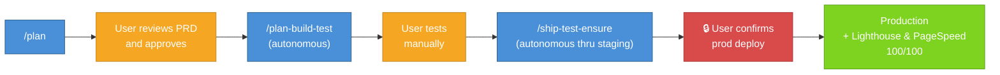

# Claude Workflow System

A portable AI engineering system for Claude Code that applies automatically to every project. Built on the Compound Engineering philosophy: each unit of work makes subsequent units easier — not harder.

## Influences & References

This system is primarily shaped by hands-on experience building production software with AI agents, combined with ideas from:

- **[Compound Engineering](https://every.to/source-code/compound-engineering-the-definitive-guide)** — The methodology developed by [Every, Inc.](https://every.to/guides/compound-engineering) where each unit of work improves the system for the next. The Plan → Work → Review → Compound loop and the 80/20 split (planning+review vs. implementation) come from here. See also the [official Claude Code plugin](https://github.com/EveryInc/compound-engineering-plugin).
- **[Context Engineering](https://x.com/karpathy/status/1937902205765607626)** — The discipline of structuring everything an LLM needs to make reliable decisions, as articulated by [Andrej Karpathy](https://x.com/karpathy/status/1937902205765607626) and [Tobi Lütke](https://x.com/tobi/status/1935533422589399127). The agent architecture, worktree isolation, context budget rules, and context rot protocols in this system are context engineering in practice. See also [Context Engineering: 4 Principles for AI Coding CLIs](https://tail-f-thoughts.hashnode.dev/context-engineering-ai-coding-cli) for a practical walkthrough of these principles applied to this workflow.
- **[The AI-Human Engineering Stack](https://github.com/hjasanchez/agentic-engineering/blob/main/The%20AI-Human%20Engineering%20Stack.pdf)** (Mill & Sanchez, 2026) — A layered model (Prompt, Context, Intent, Judgment, Coherence) that informed the value hierarchy, judgment protocols, and evaluation framework.
- **[The Complete Guide to Specifying Work for AI](https://github.com/hjasanchez/agentic-engineering/blob/main/The%20Complete%20Guide%20to%20Specifying%20Work%20for%20AI.pdf)** (Mill & Sanchez, 2026) — Practical methods for translating human intent into AI-readable specifications that shaped the Contract-First pattern, Correctness Discovery, and PRD templates.
- **[From Vibe Coding to Agentic Engineering](https://heavychain.org/blog?article=from-vibe-coding-to-agentic-engineering)** (Jason Vertrees / Heavy Chain Engineering, 2026) — A practitioner's account of building 270K lines in one week with disciplined AI agents. Key ideas adopted: the Architecture Invariant Registry (cross-module contracts with preconditions/postconditions/invariants), the "Modular Success Trap" insight (modules pass in isolation but integration seams break), enforcement via hard-gate hooks rather than verbal instructions, and the Build Candidate concept as a design-phase gate.
- **Personal experience** — Patterns, anti-patterns, hooks, and safety rules discovered through months of real-world AI-assisted development across multiple production projects.

## Quick Start

> **CAUTION:** This system installs to `~/.claude/`, which is the **user-level** configuration directory for Claude Code. Cloning this repository will **replace your existing personal configuration** — including your `CLAUDE.md`, `settings.json`, hooks, and any other customizations you've made. This is NOT a per-project setup; it affects **every project** you open with Claude Code. Back up your existing `~/.claude/` directory before proceeding.

```bash
# 1. Back up your existing configuration (important!)
cp -r ~/.claude ~/.claude.backup 2>/dev/null

# 2. Clone to ~/.claude/
git clone <repository-url> ~/.claude

# 3. Open any project with Claude Code
cd /path/to/your/project
claude

# 4. That's it — the system loads automatically
```

Hooks enforce rules deterministically, agents handle complex work, and skills auto-invoke based on what you're doing. Project-specific context goes in each project's own `CLAUDE.md` (see [Getting Started](workflow/02-getting-started.md)).

## How It Works

```
PLAN → WORK → REVIEW → COMPOUND → (next task is now easier)
```

The core loop. Plan + Review = 80% of effort. Work + Compound = 20%. The bottleneck is knowing **what** to build and **verifying** it was built correctly — not typing speed.

## The Autonomous Pipeline

The preferred end-to-end workflow minimizes human touchpoints to four: review the plan, approve it, test manually, confirm production deploy. Everything else runs without interruption.



**What each step does:**

1. **`/plan`** — Generates a PRD (Product Requirements Document) with sprint decomposition, acceptance criteria, and an architecture invariant registry. The user reviews and approves.
2. **`/plan-build-test`** — Picks up the approved PRD, spawns agent teams in isolated worktrees, implements each sprint, runs all tests and E2E locally. Runs autonomously from start to finish — no checkpoints.
3. **User tests manually** — The only hands-on step. Verify the feature works as intended.
4. **`/ship-test-ensure`** — Commits, pushes a branch, creates a PR, merges via CI/CD, follows the staging deploy, runs E2E on staging, then **asks the user once** before deploying to production. After production deploy, runs Lighthouse/PageSpeed audits.

**Safety gates that autonomous mode never skips:**
- Production deploy requires user confirmation
- Rollback decisions require user confirmation
- Escalation logic still applies (ambiguity, scope > 2x, etc.)
- Anti-Premature Completion Protocol still enforced
- Verification Integrity rules still enforced

After shipping, `/compound` auto-captures learnings and promotes patterns — making the next task easier. That's the compound loop.

## Repository Structure

```
~/.claude/
├── CLAUDE.md          # The brain — all rules, workflows, and judgment protocols
├── settings.json      # Deterministic enforcement via hooks
├── agents/            # Specialized workers with isolated context windows
│   ├── orchestrator.md    # Delegates and coordinates — never implements
│   ├── sprint-executor.md # Implements sprints in isolated worktrees
│   └── code-reviewer.md   # Read-only auditor — reports, never fixes
├── skills/            # Auto-invocable step-by-step workflows
│   ├── plan/              # PRD generation (/plan)
│   ├── create-project/    # Greenfield project PRD with architecture defaults
│   ├── plan-build-test/   # Local pipeline: discover → plan → execute → verify
│   ├── ship-test-ensure/  # Deploy: branch → PR → staging → E2E → production
│   ├── compound/          # Post-task learning capture
│   ├── workflow-audit/    # Periodic system self-review
│   ├── update-docs/       # Analyze code and update project documentation
│   └── playwright-stealth/# Anti-detection web browsing for own content
├── hooks/             # Safety enforcement scripts (language-universal)
│   ├── lib/
│   │   └── detect-project.sh   # Shared language/project detection (16 languages)
│   ├── block-dangerous.sh     # Blocks rm -rf, force push, project-aware pkg mgr
│   ├── check-test-exists.sh   # TDD gate — blocks edits without test file (all langs)
│   ├── check-invariants.sh    # Verifies INVARIANTS.md rules after edits
│   ├── post-edit-quality.sh   # Auto-formats code after every edit (all langs)
│   ├── end-of-turn-typecheck.sh # Static type checking (all langs)
│   ├── compound-reminder.sh   # Blocks session end without learning capture
│   ├── verify-completion.sh   # Blocks premature completion claims
│   ├── validate-i18n-keys.sh  # Cross-validates i18n keys across locales
│   ├── verify-worktree-merge.sh # Detects silent overwrites in worktree merges
│   ├── check-docs-updated.sh # Blocks push if workflow changed without doc updates
│   ├── proot-preflight.sh    # First-command session setup for proot-distro
│   ├── worktree-preflight.sh # Language-aware worktree dependency setup
│   ├── retry-with-backoff.sh # Retry helper for external API calls
│   └── validate-sprint-boundaries.sh # Validates sprint file boundaries
├── test-workflow-mods/# Workflow integrity test suite (123 assertions)
│   ├── run-tests.sh           # Validates entire ~/.claude/ structure
│   └── testdata/              # Fixture projects for hook behavioral tests
├── docs/              # Reference material (loaded on demand, not every session)
│   ├── universal-workflow-guide.md  # How to use/extend for any language
│   ├── evaluation-reference.md
│   ├── anti-patterns-full.md
│   ├── verification-gates.md
│   ├── project-claude-md-template.md
│   └── vague-requirements-translator.md
├── workflow/          # Full documentation (you are here)
└── evolution/         # Cross-project learning data
    └── session-postmortems/    # Post-session analysis and learnings
```

## Skills

| Skill | What It Does | When to Use |
|---|---|---|
| `/plan` | Generates PRD only | "Just plan, don't build yet" |
| `/create-project` | Greenfield project PRD with discovery interview and architecture defaults | "New project", "start a project", "build me an app" |
| `/plan-build-test` | Plans, executes with agent teams, verifies locally | "Build this feature / fix this bug" |
| `/ship-test-ensure` | Branch, PR, staging E2E, production deploy, Lighthouse (optional) | "Ship what I've built" |
| `/compound` | Captures learnings, updates error registry, evolves system | Auto-invoked after task completion |
| `/workflow-audit` | Reviews model performance, error patterns, rule staleness | Monthly or after 10+ sessions |
| `/update-docs` | Analyzes codebase and updates README/docs to match current code | "Update docs", "sync readme", or when push is blocked by stale docs |
| `/playwright-stealth` | Anti-detection web browsing via Patchright + Xvfb for own content | "Stealth browse", "check this site", sites with bot detection |

**Autonomous pipeline:** `/plan` → review PRD → `/plan-build-test` (autonomous) → manual test → `/ship-test-ensure` (autonomous through staging, confirms before production).

## The Three Agents

| Agent | Role | Model | Key Constraint |
|---|---|---|---|
| **Orchestrator** | Delegates, coordinates, merges | sonnet | Never implements code directly |
| **Sprint Executor** | Implements sprints in isolation | sonnet | Cannot delegate to other agents |
| **Code Reviewer** | Read-only post-merge audit | sonnet | Cannot modify any files |

## Safety Enforcement (Hooks)

The system uses deterministic hooks — real code that runs before/after every action. Unlike CLAUDE.md instructions (which the model might ignore), hooks **cannot be bypassed**.

| Hook | Trigger | What It Does |
|---|---|---|
| `block-dangerous.sh` | Every Bash command | Blocks `rm -rf /`, force push; project-aware package manager enforcement |
| `check-test-exists.sh` | Every file edit | TDD gate — blocks production code edits without test file (16 languages) |
| `check-invariants.sh` | Every file edit | Verifies INVARIANTS.md rules after edits |
| `post-edit-quality.sh` | Every file edit | Auto-formats code using detected formatter (Biome, ruff, rustfmt, gofmt, etc.) |
| `end-of-turn-typecheck.sh` | Session end | Static type checking (tsc, cargo check, go vet, mypy, pyright, etc.) |
| `compound-reminder.sh` | Session end | Blocks exit without learning capture |
| `verify-completion.sh` | Session end | Blocks premature completion without evidence |
| `validate-i18n-keys.sh` | Pre-commit (via ship-test-ensure) | Cross-validates all i18n t() keys exist in all locale files |
| `verify-worktree-merge.sh` | Post-merge (via orchestrator) | Detects files silently overwritten by worktree merges |
| `check-docs-updated.sh` | Every `git push` (PreToolUse) | Blocks push if hooks/skills/agents changed without doc updates |
| `proot-preflight.sh` | First Bash command per session | Detects proot-distro ARM64, sets env vars, language-aware warnings |
| `worktree-preflight.sh` | Orchestrator step 0 | Detects project languages, installs deps per-language in worktrees |
| `validate-sprint-boundaries.sh` | After sprint extraction | Validates no file conflicts between parallel sprints |

All hooks auto-detect the project's language(s) via `hooks/lib/detect-project.sh`. Adding support for a new language means updating one file — see [Universal Workflow Guide](docs/universal-workflow-guide.md).

#### Supported Languages

TypeScript, JavaScript, Python, Go, Rust, Ruby, Java, Kotlin, Elixir, Swift, Dart, C#, Scala, C/C++, Haskell, and Zig. Each language gets: TDD enforcement with idiomatic test patterns, auto-formatting with the project's configured tools, end-of-turn type/static checking, and language-aware dependency management in worktree preflight.

### Workflow Integrity Tests

The system includes a self-test suite (`test-workflow-mods/run-tests.sh`) with 123 assertions that validates the entire `~/.claude/` structure: hook existence and executability, settings.json registration and cross-references, CLAUDE.md documentation coverage, agent/skill structure, and evolution infrastructure. Runs automatically as the final step of `/compound` whenever workflow files are modified.

## Full Documentation

Detailed documentation lives in [`workflow/`](workflow/):

### Getting Started
- [Introduction](workflow/01-introduction.md) — What this system is, why it exists, and the Compound Engineering philosophy
- [Getting Started](workflow/02-getting-started.md) — Installation, setup, first run, and project configuration

### Understanding the System
- [Architecture](workflow/03-architecture.md) — Repository structure, layers, and how everything connects
- [The Constitution](workflow/04-constitution.md) — Value hierarchy, decision boundaries, and autonomous authority
- [Workflow & Modes](workflow/05-workflow-and-modes.md) — Execution modes, Contract-First pattern, and the autonomous pipeline
- [Sprint System](workflow/06-sprint-system.md) — PRDs, sprint decomposition, templates, and file boundaries

### Components
- [Agents](workflow/07-agents.md) — Orchestrator, Sprint Executor, and Code Reviewer in depth
- [Skills Reference](workflow/08-skills-reference.md) — All five skills with full phase breakdowns
- [Hooks & Enforcement](workflow/09-hooks-and-enforcement.md) — `settings.json`, hook lifecycle, and adding custom hooks
- [Evolution & Learning](workflow/10-evolution-and-learning.md) — Cross-project learning, error registry, model performance

### Quality & Verification
- [Verification & Quality](workflow/11-verification-and-quality.md) — 6 verification gates, Anti-Goodhart, Anti-Premature Completion

### Specialized Topics
- [proot-distro Guide](workflow/12-proot-distro-guide.md) — ARM64 environment setup, known issues, and workarounds
- [End-to-End Example](workflow/13-end-to-end-example.md) — Complete walkthrough from feature request to production

### Reference
- [Design Principles](workflow/14-design-principles.md) — 10 recurring principles that guide the entire system
- [Glossary](workflow/15-glossary.md) — Terms and definitions